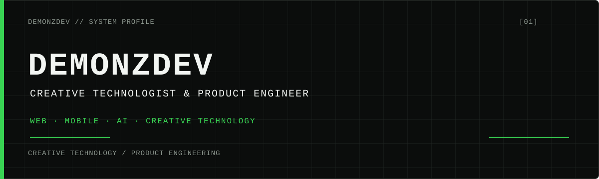

  
   
  DEMONZDEV // PROFILE

---

## SYSTEM STATUS

<table>
  <tr>
    <td>CURRENT</td>
    <td><strong>FINORA</strong></td>
  </tr>
  <tr>
    <td>MODE</td>
    <td>PRODUCT / ENGINEERING</td>
  </tr>
  <tr>
    <td>FOCUS</td>
    <td>WEB · MOBILE · AI · CREATIVE</td>
  </tr>
</table>

## SELECTED BUILDS

### 01 / [FINORA](https://github.com/Demonz-30/FINORA)

Offline-first financial management application focused on structured expense tracking and budgeting.

FLUTTER · SQLITE · SUPABASE

---

### 02 / [DEMONZDEV PORTFOLIO](https://github.com/Demonz-30/demonzdev-portofolio)

Interactive portfolio and creative system using modern web technologies, 3D, and motion.

NEXT.JS · REACT · TYPESCRIPT · TAILWIND CSS · GSAP · THREE.JS

[Live portfolio → demonz-portfolio.pages.dev](https://demonz-portfolio.pages.dev)

---

### 03 / [DEMONZ COFFEE](https://github.com/Demonz-30/demonz-coffee-website)

Commercial website and digital presence connecting web development with product identity and brand storytelling.

WEB / DIGITAL PRESENCE

## TECHNOLOGY MATRIX

  APPLICATION / WEB 
  

  DATA / INFRASTRUCTURE 
  

  <code>AGENTIC AI / AUTOMATION</code>
   
  CREATIVE TECHNOLOGY · REACT THREE FIBER · GSAP

## BUILD SYSTEM

  <code>WEB → MOBILE → PRODUCT SYSTEMS</code> 
  <code>AI / AUTOMATION → CREATIVE TECHNOLOGY</code>

## ACTIVITY

Building in public, one system at a time.

## PRINCIPLES

### <code>BUILD → TEST → ITERATE → SHIP</code>

Make the idea real, test it in software, then give it another pass.

## EXTERNAL INTERFACES

- **Portfolio** — [demonz-portfolio.pages.dev](https://demonz-portfolio.pages.dev)
- **GitHub** — [Demonz-30](https://github.com/Demonz-30)

---

I don't just write code. 
I turn ideas into products.

