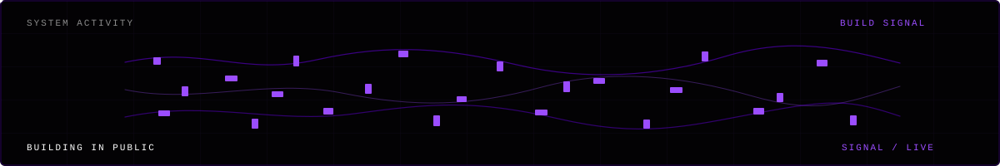

  

  ↓ 
  // SYSTEM STATUS

  <code>CURRENT</code> &nbsp; <strong>FINORA</strong> 
  <code>MODE</code> &nbsp;&nbsp;&nbsp;&nbsp; PRODUCT / ENGINEERING 
  <code>FOCUS</code> &nbsp;&nbsp;&nbsp; WEB · MOBILE · AI · CREATIVE

## <code>SELECTED BUILDS</code>

  01 / BUILD 
  <strong><a href="https://github.com/Demonz-30/FINORA">FINORA</a></strong> 
  Offline-first financial management application focused on structured expense tracking and budgeting. 
  FLUTTER · SQLITE · SUPABASE

  02 / BUILD 
  <strong><a href="https://github.com/Demonz-30/demonzdev-portofolio">DEMONZDEV PORTFOLIO</a></strong> 
  Interactive portfolio and creative system using modern web technologies, 3D, and motion. 
  NEXT.JS · REACT · TYPESCRIPT · TAILWIND CSS · GSAP · THREE.JS 
  <a href="https://demonz-portfolio.pages.dev">LIVE → demonz-portfolio.pages.dev</a>

  03 / BUILD 
  <strong><a href="https://github.com/Demonz-30/demonz-coffee-website">DEMONZ COFFEE</a></strong> 
  Commercial website and digital presence connecting web development with product identity and brand storytelling. 
  WEB / DIGITAL PRESENCE

## <code>TECHNOLOGY</code>

  

  <code>WEB</code> 
   Next.js &nbsp;
   React &nbsp;
   TypeScript &nbsp;
   Tailwind CSS  
  <code>MOBILE</code> 
   Flutter &nbsp;
   Dart  
  <code>DATA / BACKEND</code> 
   PostgreSQL &nbsp;
   Supabase &nbsp;
   SQLite  
  <code>INFRASTRUCTURE</code> 
   Git &nbsp;
   Cloudflare  
  <code>CREATIVE TECHNOLOGY</code> 
   Three.js &nbsp;
   React Three Fiber &nbsp;
   GSAP  
  <code>AI / AUTOMATION</code> 
   Agentic AI / Automation

## <code>BUILD SYSTEM</code>

  <code>WEB → MOBILE → PRODUCT SYSTEMS</code> 
  <code>AI / AUTOMATION → CREATIVE TECHNOLOGY</code>

## <code>ACTIVITY</code>

  

ACTIVITY LOG 
Building in public, one system at a time.

## <code>PRINCIPLES</code>

  <h3><code>BUILD → TEST → ITERATE → SHIP</code></h3>
  Make the idea real, test it in software, then give it another pass.

## <code>EXTERNAL INTERFACES</code>

  <code>PORTFOLIO</code> — <a href="https://demonz-portfolio.pages.dev">demonz-portfolio.pages.dev</a> 
  <code>GITHUB</code> — <a href="https://github.com/Demonz-30">Demonz-30</a>

  SYSTEM END  
  I don't just write code. 
  I turn ideas into products.

