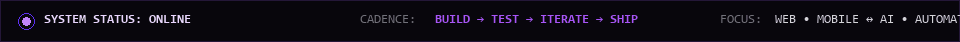
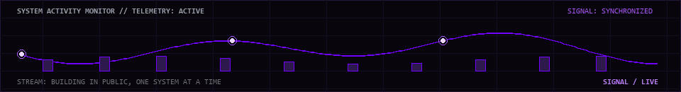

  

  

 

  <h3><code>BUILD → TEST → ITERATE → SHIP</code></h3>
  

    <strong>DEMONZDEV</strong> is my personal builder identity. 
    I design, engineer, test, and ship digital products across modern web applications, mobile platforms, and automated systems.
  

 

## <code>CAPABILITY SYSTEM</code>

<table width="100%" cellspacing="0" cellpadding="0" style="border-collapse: collapse;">
  <tr>
    <td width="50%" valign="top" style="padding: 18px; border: 1px solid #261b3d; background: #06040a;">
      <code>01 / WEB PLATFORMS</code> 
      <strong>Frontend &amp; Web Systems</strong> 
      Modern reactive interfaces, responsive component hierarchies, and performant state management.  
      <code>STACK</code> 
      

         Next.js &nbsp;|&nbsp;
         React 
         TypeScript &nbsp;|&nbsp;
         Tailwind CSS
      

    </td>
    <td width="50%" valign="top" style="padding: 18px; border: 1px solid #261b3d; background: #06040a;">
      <code>02 / MOBILE SYSTEMS</code> 
      <strong>Cross-Platform Mobile</strong> 
      Mobile applications engineered with clean state separation and offline-first workflows.  
      <code>STACK</code> 
      

         Flutter &nbsp;|&nbsp;
         Dart 
         SQLite &nbsp;|&nbsp; Local Persistence
      

    </td>
  </tr>
  <tr>
    <td width="50%" valign="top" style="padding: 18px; border: 1px solid #261b3d; background: #06040a;">
      <code>03 / BACKEND &amp; DATA</code> 
      <strong>Services &amp; Persistence</strong> 
      Structured RESTful APIs, token-based authentication, and relational datastores.  
      <code>STACK</code> 
      

        Node.js &nbsp;|&nbsp; Express 
         PostgreSQL &nbsp;|&nbsp; REST APIs
      

    </td>
    <td width="50%" valign="top" style="padding: 18px; border: 1px solid #261b3d; background: #06040a;">
      <code>04 / AI &amp; AUTOMATION</code> 
      <strong>Intelligent Workflows &amp; Logic</strong> 
      Algorithmic task orchestration, intelligent matching logic, and automated script pipelines.  
      <code>STACK</code> 
      

         Agentic Workflows &nbsp;|&nbsp; Task Parsing &nbsp;|&nbsp; Python Scripting
      

    </td>
  </tr>
  <tr>
    <td width="100%" colspan="2" valign="top" style="padding: 18px; border: 1px solid #261b3d; background: #06040a;">
      <code>05 / PRODUCT &amp; CREATIVE TECHNOLOGY</code> 
      <strong>Interactive Systems &amp; UI Architecture</strong> 
      Typographic hierarchies, structured design systems, and WebGL canvas choreography.  
      <code>STACK</code> 
      

         Three.js &nbsp;|&nbsp;
         GSAP Motion &nbsp;|&nbsp;
         Git &amp; GitHub &nbsp;|&nbsp; UI/UX Architecture
      

    </td>
  </tr>
</table>

 

## <code>SELECTED BUILDS</code>

<table width="100%" cellspacing="0" cellpadding="0" style="border-collapse: collapse;">
  <tr>
    <td style="padding: 18px; border: 1px solid #261b3d; background: #06040a;">
      01 / FLAGSHIP PLATFORM 
      <strong style="font-size: 16px;">DEMONZDEV PORTFOLIO</strong> &nbsp;<code>LIVE</code> 
      Modern digital portfolio and interactive system showcasing web platforms, mobile architectures, and creative experiments. 
      <small><strong>Stack:</strong> Next.js · React · TypeScript · Tailwind CSS · Three.js · GSAP</small> 
      

        <a href="https://demonzdev.my.id"><strong>Live Platform → demonzdev.my.id</strong></a> &nbsp;|&nbsp;
        <a href="https://github.com/Demonz-30/demonzdev-portofolio">Repository → Demonz-30/demonzdev-portofolio</a>
      

    </td>
  </tr>
  <tr>
    <td style="padding: 18px; border: 1px solid #261b3d; background: #06040a;">
      02 / COMMERCIAL BRAND &amp; WEB 
      <strong style="font-size: 16px;">DEMONZ COFFEE</strong> &nbsp;<code>LIVE</code> 
      Real-world coffee brand platform combining product development, visual brand identity, commercial photography, and interactive web presence. 
      <small><strong>Stack:</strong> HTML5 · CSS3 · Modern JavaScript · Three.js 360° · GSAP Motion</small> 
      

        <a href="https://demonzcoffe.web.id"><strong>Live Platform → demonzcoffe.web.id</strong></a> &nbsp;|&nbsp;
        <a href="https://github.com/Demonz-30/demonz-coffee-website">Repository → Demonz-30/demonz-coffee-website</a>
      

    </td>
  </tr>
  <tr>
    <td style="padding: 18px; border: 1px solid #261b3d; background: #06040a;">
      03 / MOBILE APPLICATION 
      <strong style="font-size: 16px;">FINORA</strong> &nbsp;<code>ACTIVE BUILD</code> 
      Personal finance mobile application engineered for transaction tracking, budgeting overviews, and an offline-first workflow for students and freelancers. 
      <small><strong>Stack:</strong> Flutter · Dart · SQLite Local Persistence · UI/UX Design System</small> 
      

        <a href="https://demonzdev.my.id/work/finora"><strong>Case Study &amp; Architecture Overview →</strong></a>
      

    </td>
  </tr>
  <tr>
    <td style="padding: 18px; border: 1px solid #261b3d; background: #06040a;">
      04 / AI &amp; AUTOMATION SYSTEM 
      <strong style="font-size: 16px;">HYPERASSIST</strong> &nbsp;<code>PROTOTYPE</code> 
      Hyperlocal micro-service marketplace concept with AI task parsing workflows, structured service contracts, and automated helper matching. 
      <small><strong>Stack:</strong> Node.js · Express · PostgreSQL · JWT Authentication · AI Task Workflows</small> 
      

        <a href="https://demonzdev.my.id/work/hyperassist"><strong>Case Study &amp; Architecture Overview →</strong></a>
      

    </td>
  </tr>
</table>

 

## <code>CURRENTLY BUILDING</code>

  <code>[ACTIVE BUILD]</code> &nbsp; <strong>FINORA</strong> — Personal finance mobile application with offline-first client architecture. 
  <code>[PROTOTYPE]</code> &nbsp; <strong>HyperAssist</strong> — AI-assisted hyperlocal micro-service task routing platform. 
  <code>[CADENCE]</code> &nbsp; Focus on turning functional ideas into verified, ship-ready software rather than accumulating incomplete concepts.

 

## <code>SYSTEM ACTIVITY</code>

  

  SIGNAL: ACTIVE // BUILDING IN PUBLIC, ONE SYSTEM AT A TIME.

 

## <code>INTERFACES &amp; CONNECT</code>

  <code>PORTFOLIO</code> — <a href="https://demonzdev.my.id">https://demonzdev.my.id</a> 
  <code>GITHUB</code> — <a href="https://github.com/Demonz-30">github.com/Demonz-30</a> 
  <code>LINKEDIN</code> — <a href="https://www.linkedin.com/in/muhammad-munir-alfaruq-283b0b367/">linkedin.com/in/muhammad-munir-alfaruq-283b0b367</a>

 

  

  DEMONZDEV // BUILD. TEST. SHIP. 
  <small><em>I don't just write code — I turn ideas into usable products.</em></small>

